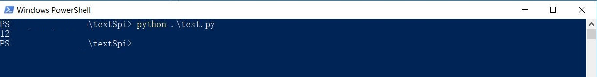
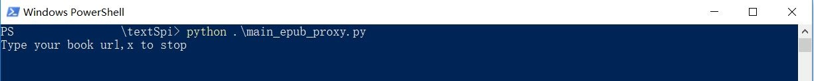
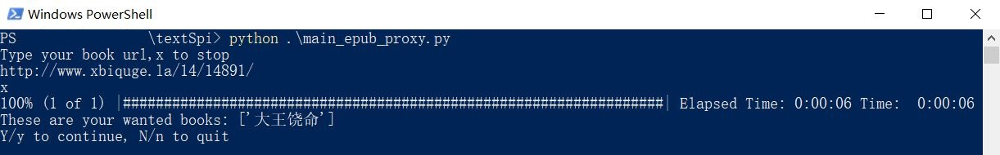

#笔趣阁小说EPUB、TXT格式爬虫

##介绍
主要是为了在Kindle上看起来方便，因为传统爬虫生成的txt没有目录，并不能在Kindle上随心所欲地跳转到想看的章节，所以就搞了个epub格式的，转成mobi以后在Kindle上也可以从目录跳转到任意一个想看的章节。

顺便现在的笔趣阁限制单个ip的短时间内访问量了，所以引入了代理池和多线程，不过启用代理池需要安装Redis，Redis的安装包放在/utils里面了

##使用方法-EPUB多线程+代理池版
1.下载源码到本地以后，先安装Redis

Redis安装包在utils里面，就是那个Redis-x64-3.2.100.msi，不放心的也可以从Redis在Github上的仓库[https://github.com/MicrosoftArchive/redis/releases](https://github.com/MicrosoftArchive/redis/releases)里直接下载安装。

2.启动代理池

打开utils/proxy_pool-2.1.0/，先使用`python proxyPool.py schedule`运行代理池调度程序，再使用`python proxyPool.py server`运行代理池服务端程序。运行后的效果如下：

3.测试代理池运行状态

代理池需要先运行一会，使用`python test.py`来测试当前有效代理数量

一般数量大于5个以后就可以运行爬虫了，调度程序会继续补充代理池的，如果数量为0的话建议检查一下Redis有没有设置密码，如果设置了密码的话到utils/proxy_pool-2.1.0/setting.py中加入密码重启代理池，如果有修改Redis端口的话记得也修改一下settings.py

4.运行爬虫

使用`python main_epub_proxy.py`运行代理池版本的爬虫，运行效果如下：

依次输入想要下载的小说的链接，链接如下图：

可输入多个，输入完最后一个以后键入x来结束，然后脚本会依次获取小说名称，确认以后输入Y或y开始下载小说

默认线程数量75，使用代理以后绕过了本机ip短时间内的访问量限制，所以速度还是挺快的，2000章的小说一般6分钟左右就可以下载完，传统爬虫不使用代理的话受访问量限制一般在50分钟左右才能下完

运行中的效果：

##使用方法-EPUB普通版

普通版就不需要开代理池了，直接使用`python main_epub.py`运行脚本就行了

##使用方法-TXT多线程+代理池版

TXT的代理池版本和EPUB的使用方法一样，使用命令为`python main_txt_proxy.py`，TXT版和EPUB版最后的输出路径不同，TXT版会把小说保存到output/txt中，EPUB版会保存到output/epub中

##使用方法-TXT普通版

应该不用多说了8，命令`python main_txt.py`

##转换MOBI格式

建议使用格式工厂，老方便了，十几MB的MOBI两分钟左右就转换完了，传到Kindle上就能看

##效果

##保存路径
txt版保存在output/txt

epub版保存在output/epub

